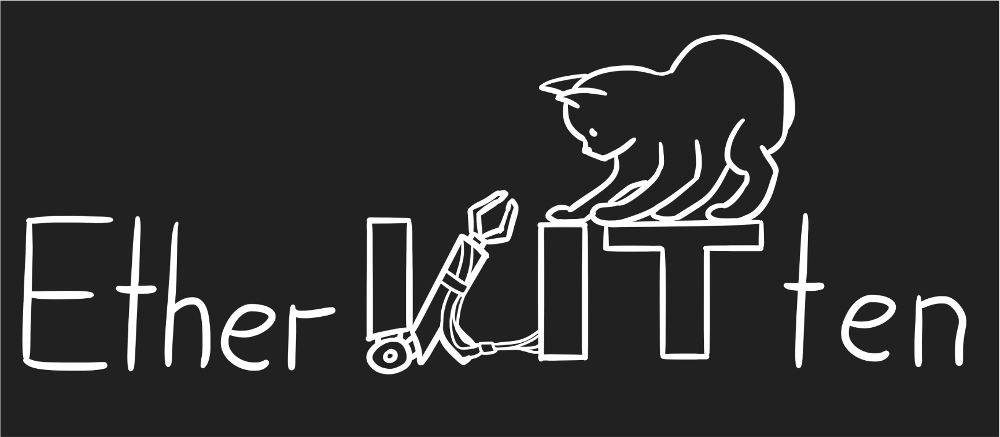

<h1 align="center">EtherKITten</h1>



EtherKITten is designed to simplify diagnosing problems on EtherCAT buses and thus speed up the development of robot bus systems.
Typically, it is difficult to pinpoint problems in these systems because they involve a large number of components and operate at high speed, making it difficult to track down problems in real time.
In particular, the diagnostically valuable information from the EtherCAT bus that is already available according to the EtherCAT specification should be presented to the user in a clear manner.

For this purpose, the topology of the attached EtherCAT bus is visualised as a graph.
In this graph will errors then be displayed at the node or edge corresponding to their origin.
In addition, process data and diagnostically relevant registers are automatically read by EtherKITten and displayed seperately for each slave.
This collected data may be added to plots in order to easily view the data on the EtherCAT bus even over extended time periods.
Overall, EtherKITten offers a comprehensive set of tools to support developers and users of EtherCAT bus systems.

# Table of Contents

- [Project Structure](#project-structure)
- [Prerequisites](#prerequisites)
- [Build Instructions](#build-instructions)
- [Compilation](#compilation)
- [Testing](#testing)
- [Description of the GUI](#description-of-the-gui)

# Project Structure
The project is split into several modules that are compiled separately. Each module has its own `src/` and `test/` folders. The `src/` folders contain the source code and headers for that module, while the `test/` folders contain unit tests for the testing framework Catch2. The top-level `test/` folder contains the main function that is used for all tests to save on compilation time.

# Prerequisites
## Recommended: Build using Docker

First setup docker

1. [Install docker](https://docs.docker.com/engine/install/ubuntu/)
1. [Post installation steps](https://docs.docker.com/engine/install/linux-postinstall/)

Then execute

```
docker build -t etherkittendev .
docker run --rm -it -v $(pwd):/workdir etherkittendev /bin/bash
```

Now you're inside the virtual machine you use to build docker. Your files are mounted in `/workdir`.

```
cd workdir
mkdir build
cd build
cmake -DBUILD_TESTING=OFF -DSTANDALONE=ON ..
make -j 16
```

This will create a standalone library that only depends on standard libraries and Qt5. The qt libraries can be installed `qtbase5-dev`. Make sure to install qt5 on your host system (not inside docker container).

```console
sudo apt install qtbase5-dev
```


<details>
```
tobi@tobi-Z590-VISION-G:~/git/etherkitten$ ldd build/bin/etherkitten 
        linux-vdso.so.1 (0x00007fffc30cc000)
        libpthread.so.0 => /lib/x86_64-linux-gnu/libpthread.so.0 (0x00007f52a2032000)
        libQt5PrintSupport.so.5 => /lib/x86_64-linux-gnu/libQt5PrintSupport.so.5 (0x00007f52a1fba000)
        libQt5Widgets.so.5 => /lib/x86_64-linux-gnu/libQt5Widgets.so.5 (0x00007f52a0d3f000)
        libQt5Gui.so.5 => /lib/x86_64-linux-gnu/libQt5Gui.so.5 (0x00007f52a0661000)
        libQt5Core.so.5 => /lib/x86_64-linux-gnu/libQt5Core.so.5 (0x00007f52a0102000)
        libstdc++.so.6 => /lib/x86_64-linux-gnu/libstdc++.so.6 (0x00007f529fed8000)
        libm.so.6 => /lib/x86_64-linux-gnu/libm.so.6 (0x00007f52a1ed1000)
        libgcc_s.so.1 => /lib/x86_64-linux-gnu/libgcc_s.so.1 (0x00007f52a1eb1000)
        libc.so.6 => /lib/x86_64-linux-gnu/libc.so.6 (0x00007f529fcb0000)
        /lib64/ld-linux-x86-64.so.2 (0x00007f52a204c000)
        libGL.so.1 => /lib/x86_64-linux-gnu/libGL.so.1 (0x00007f529fc29000)
        libpng16.so.16 => /lib/x86_64-linux-gnu/libpng16.so.16 (0x00007f529fbee000)
        libz.so.1 => /lib/x86_64-linux-gnu/libz.so.1 (0x00007f529fbd2000)
        libharfbuzz.so.0 => /lib/x86_64-linux-gnu/libharfbuzz.so.0 (0x00007f529fb03000)
        libmd4c.so.0 => /lib/x86_64-linux-gnu/libmd4c.so.0 (0x00007f529faf1000)
        libdouble-conversion.so.3 => /lib/x86_64-linux-gnu/libdouble-conversion.so.3 (0x00007f529fadc000)
        libicui18n.so.70 => /lib/x86_64-linux-gnu/libicui18n.so.70 (0x00007f529f7ad000)
        libicuuc.so.70 => /lib/x86_64-linux-gnu/libicuuc.so.70 (0x00007f529f5b2000)
        libpcre2-16.so.0 => /lib/x86_64-linux-gnu/libpcre2-16.so.0 (0x00007f529f528000)
        libzstd.so.1 => /lib/x86_64-linux-gnu/libzstd.so.1 (0x00007f529f459000)
        libglib-2.0.so.0 => /lib/x86_64-linux-gnu/libglib-2.0.so.0 (0x00007f529f31f000)
        libGLdispatch.so.0 => /lib/x86_64-linux-gnu/libGLdispatch.so.0 (0x00007f529f267000)
        libGLX.so.0 => /lib/x86_64-linux-gnu/libGLX.so.0 (0x00007f529f233000)
        libfreetype.so.6 => /lib/x86_64-linux-gnu/libfreetype.so.6 (0x00007f529f16b000)
        libgraphite2.so.3 => /lib/x86_64-linux-gnu/libgraphite2.so.3 (0x00007f529f144000)
        libicudata.so.70 => /lib/x86_64-linux-gnu/libicudata.so.70 (0x00007f529d526000)
        libpcre.so.3 => /lib/x86_64-linux-gnu/libpcre.so.3 (0x00007f529d4b0000)
        libX11.so.6 => /lib/x86_64-linux-gnu/libX11.so.6 (0x00007f529d370000)
        libbrotlidec.so.1 => /lib/x86_64-linux-gnu/libbrotlidec.so.1 (0x00007f529d360000)
        libxcb.so.1 => /lib/x86_64-linux-gnu/libxcb.so.1 (0x00007f529d336000)
        libbrotlicommon.so.1 => /lib/x86_64-linux-gnu/libbrotlicommon.so.1 (0x00007f529d313000)
        libXau.so.6 => /lib/x86_64-linux-gnu/libXau.so.6 (0x00007f529d30d000)
        libXdmcp.so.6 => /lib/x86_64-linux-gnu/libXdmcp.so.6 (0x00007f529d305000)
        libbsd.so.0 => /lib/x86_64-linux-gnu/libbsd.so.0 (0x00007f529d2eb000)
        libmd.so.0 => /lib/x86_64-linux-gnu/libmd.so.0 (0x00007f529d2de000)
```
</details>

Then etherkitten is executable under Ubuntu 22.04.

```console
build/bin/etherkitten
```

## Target System

* Ubuntu 18.04 LTS
* multi-core machine
* real-time kernel patch is recommended for non-trivial buses

## Required Software

* cmake (minimum v3.10)
* g++-8 (v8.4.0)
* [SOEM](#SOEM-dependency) (custom version)
* [Catch2 (optional)](#catch2-dependency-for-tests) (v2.13.4)
* Qt (v5.9.5)
    * qttools5-dev
    * libqt5core5a
    * libqt5widgets5
    * libqt5printsupport5
    * qttools5-dev
    * qtbase5-dev
* boost (v1.65)
    * boost::lockfree::policies
    * boost::lockfree::spsc_queue

## SOEM dependency
This project uses the [H2T fork of SOEM](https://gitlab.com/h2t/SOEM.git), specifically the branch *debian*. To build the `reader` module, you will have to install SOEM like this:
```bash
git clone https://gitlab.com/h2t/SOEM.git
cd SOEM
git checkout debian
mkdir build
cd build
cmake ..
make
make install
```

To then build EtherKITten, you have (at least) two options:
* move the contents of `SOEM/install` to some standard install directory (e.g. `/usr/local`).
* run CMake with the `SOEM_DIR` environment variable set to your install directoy (e.g. `$ SOEM_DIR=~/SOEM/install cmake ..`). You only have to do this once, at least until you delete the `CMakeCache.txt` in your build directory or build in a different directory.

## Catch2 dependency
**Note: this is an optional dependency. You only have to follow these instructions if you want to run the tests for EtherKITten!**

Catch2 can be installed either via a package manager (if available) or directly from the [Catch2 repository](https://github.com/catchorg/Catch2). If you're using the repository, follow these steps:
```bash
git clone https://github.com/catchorg/Catch2.git
cd Catch2
git checkout v2.13.4
mkdir build
cd build
cmake -DBUILD_TESTING=OFF ..
make
sudo make install
```

## Integrated Dependencies

* [QCustomPlot](https://www.qcustomplot.com/)
* [nlohmann/json](https://github.com/nlohmann/json)

# Compilation

## Build Instructions
```bash
mkdir build
cd build
cmake -DBUILD_TESTING=OFF ..
make
```
This will not run any tests. Therefore, the [Catch2 dependency](#catch2-dependency-for-tests) is not required.

## Documentation generation
Make sure you are in the top-level folder of the repository and execute
```bash
doxygen
```

See also the [online documentation](https://gitlab.com/h2t/student-projects/pse-ws2021/etherkitten/-/jobs/artifacts/master/file/doc/html/index.html?job=generate-documentation).

## Coding style
This project uses the coding style defined in `.clang-format`. Apply it to a file via
```bash
clang-format -style=file -i path/to/your/file.cpp
```

## Run static analysis using clang-tidy
First run CMake to generate `build/compile_commands.json`. If you haven't done so already, symlink the compilation commands to the root directory using
```bash
ln -s build/compile_commands.json compile_commands.json
```
while in the root directory. Now run
```bash
clang-tidy <file>
```
where `<file>` is the file to be analyzed.
To run static analysis and linting in QtCreator, go to `Tools > Options > Analyzer > Run Options > Diagnostic Configuration` and create a new Clang-Tidy configuration. Under `Clang-Tidy Checks`, select `Use .clang-tidy config file`. Now you can run clang-tidy from the `Analyze` menu.

# Testing

For testing, the [Catch2 dependency](#catch2-dependency-for-tests) is required.

First build with `cmake -DBUILD_TESTING=ON ..`. The `build/bin/` folder will then contain test executables that can be run to test the individual modules.
```bash
mkdir build
cd build
cmake -DBUILD_TESTING=ON ..
make
```
# Description of the GUI

## Menu Items

* "Open log" can be used to open a saved log of a previous session. While the
  log is being read, this button changes to "Cancel reading log" and can be
  used to stop reading the log.
* "Start logging" can be used while a bus is connected to log the current
  session to a file which can be inspected later. If the session is being
  logged, the button changes to "Stop logging" and can be used to stop the
  logging.
* "Connect to interface" can be used to connect to a network interface. When
  a bus is connected, this button changes to "Detach bus" and can be used
  to disconnect from the currently active bus.
* "Choose registers" can be used to set which registers should be read from
  the slaves and displayed in the [Slave Tree](#slave-tree). Note that
  disabling the "Status"-register will also disable the status display of
  the slaves in the [Slave Graph](#slave-graph) and disabling the various
  error registers will not allow the error statistics to be accurate.
* "Save profile", "Save profile as", and "Open profile" can be used to save
  and load profiles consisting of the registers to read and the positions
  of the slaves in the [Slave Graph](#slave-graph).
* "Change mode to SafeOp" can be used to change the mode of all slaves to
  safe-operational. When this has been done, the button changes to "Change
  mode to Op" and can be used to change the mode to operational again.

## Slave Tree

The Slave Tree shows information about all slaves in a tree structure. The
items may be filtered by a search string using the text entry and button
at the top. Writable items have an editing widget in the tree which can be
used to write values.  Note that PDOs may be written to even when the slave
is in safe-operational mode, but the written value will only have any effect
when the mode is changed to operational again. 

Some items have other options in the context menu:
* CoE objects are not read by default and thus have to be manually read.
* PDOs, registers, and error statistics can be added to a [plot](#plots).
* The error registers for a slave may be reset in the context menu of any
  error register belonging to it (note that the registers cannot be reset
  individually, so this resets all of them regardless of the register which
  was right-clicked).
* Numeric values may have their displayed base changed to decimal, hexadecimal,
  or binary. Note that setting the base while editing an item will cause the
  changes to be lost because the current value is written into the tree again
  with the new base.
* CoE objects, PDOs, registers, and error statistics may be added to the
  [Watchlist](#watchlist).

## Watchlist

The Watchlist is designed to make tracking the values of multiple items easier
when they would otherwise be far apart in the [Slave Tree](#slave-tree) and
would thus be difficult to look at together. Otherwise, its functionality is
the same as that of the [Slave Tree](#slave-tree).

## Error View

The Error View provides an overview over the errors encountered. At the top, it
shows a log of various errors, which may or may not be associated with
individual slaves. The timestamp shown for each error is relative to the start
of the bus connection or, when reading from a log, to the beginning of the log.
At the bottom, the total error counters for all slaves and their corresponding
frequencies are shown. It is also possible to reset all error registers or clear
the displayed log of error messages by pressing the appropriate buttons at the
bottom.

## Slave Graph

The Slave Graph shows a graph of all slaves with lines between them representing
connections. The slaves can be dragged around to match their actual topology,
and the resulting layout can be saved as part of a profile. There are also
tooltips for the slaves which provide some more information. The colors of the
slaves change depending on their status. Green means "operational", yellow
means "safe-operational", and gray means "unknown".

Additionally, some errors are shown on the slaves or the connections between
them. All errors from the error log shown in the [Error View](#error-view) are
displayed if they are associated with a slave or the connection between two
slaves. If the sum of all error frequencies for a slave is non-zero, this is
also shown as an error. These errors are displayed indefinitely, until they
are replaced by another error or the "Clear errors" button is pressed.

## Plots

PDOs, registers, and error statistics can be added to plots in order to see how
they change over time. When there are multiple plots, their time axes are
synchronized in order to allow the easy comparison of multiple plotted items.
Individual items or entire plots can be removed using the context menu.
